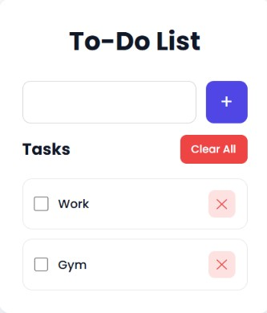

# ✅ To-Do App

A modern and responsive **To-Do List** application built with **React.js**. It helps users organize their daily tasks by allowing them to add, complete, delete, and clear tasks through a clean and intuitive user interface.

---

## 🔗 Live Demo

🌐 **Website:** https://to-do-app-rouge-seven-41.vercel.app/

---

## 📸 Preview

<p align="center">
  
</p>

---

## ✨ Features

- ➕ Add new tasks
- ✅ Mark tasks as completed
- ❌ Delete individual tasks
- 🗑️ Clear all tasks with one click
- 📱 Fully responsive design
- ⚡ Fast and lightweight React application
- 🎨 Clean and modern user interface

---

## 🛠️ Tech Stack

<p align="left">
  
  
  
  
</p>

---

## 📂 Project Structure

```text
To-do-App/
│── public/
│   └── preview.jpg
│── src/
│   ├── components/
│   ├── App.js
│   ├── index.js
│   └── ...
│── package.json
└── README.md
```

---

## 🚀 Getting Started

### Clone the repository

```bash
git clone https://github.com/Shravan-025/To-do-App.git
```

### Navigate to the project folder

```bash
cd To-do-App
```

### Install dependencies

```bash
npm install
```

### Start the development server

```bash
npm start
```

Runs the app in development mode.

Open **http://localhost:3000** in your browser to view it.

### Build for production

```bash
npm run build
```

Creates an optimized production build in the **build/** folder.

---

## 🎯 Future Improvements

- 📅 Add due dates
- 🌙 Dark mode
- 🔍 Search and filter tasks
- 🏷️ Task categories
- 💾 Persistent storage (Local Storage / Database)
- 👤 User authentication

---

## 👨‍💻 Author

**Shravan Patel**

- GitHub: https://github.com/Shravan-025
- LinkedIn: https://www.linkedin.com/in/shravan-patel-b02546325

---

## ⭐ Support

If you found this project helpful, consider giving it a **⭐ Star** on GitHub!

It motivates me to build more open-source projects.

---

<p align="center">
Made with ❤️ by <a href="https://github.com/Shravan-025">Shravan Patel</a>
</p>
